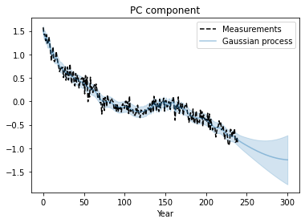
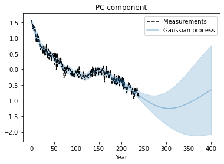
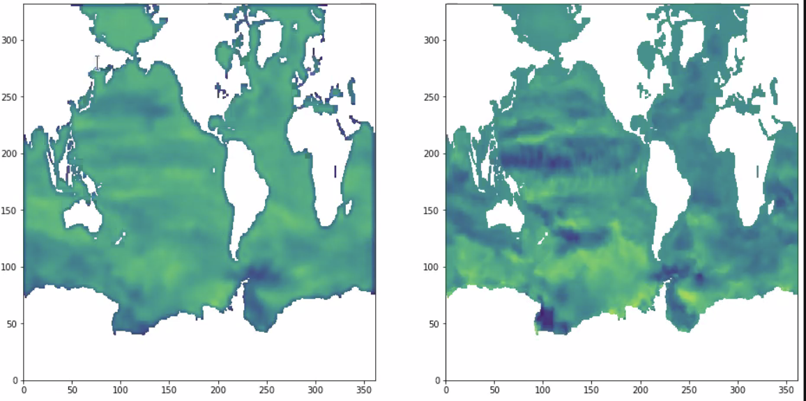

## 17 aout 

*    Nathan a posté sur /work/ de omr des cartes de fonction de courant barotrope acceleres de 10 ans pour chacune des 3 simulations de Guillaume (spinup-ref, noleap, et namelist1) : 2 cartes pour chaque simu car [1] accelere le 1er/50 modes et suppose tous les autres constants ou [2] accelere le 1er mode et c’est tout ; a priori masks ok (v>4.2)
*    apprentissage sur 3 simulations initiales (donc simus de tests exclues)

## 13 juillet 

*  souci avec donnees NEMO v>=4.2 car les continents ne sont plus les memes exactement (en plus de la difference de nombre de points de grille) - attention au recadrage des donnees : il faut enlever la ligne “en haut” ie dans l’arctic et non pas “en bas” ie dans l’antarctic
*   autre methode possible de decomposition en modes : ![SSA] (https://pyts.readthedocs.io/en/stable/auto_examples/decomposition/plot_ssa.html) ou autre… un peu de biblio necessaire ici pour voir si deja appliqué dans contexte oceano !

## 30 juin 

* retour sur les figures partagées la derniere fois : la prediction ne s’applique que sur 1 pas de temps à chaque fois ; quand on essaye de predire de maniere recurrente, alors la prediction est constante…
*  nathan a essayé la regression polynomiale, mais ne fonctionne pas du tout
* discussion large sur PCA… reflechir à autre methode de decomposition : 
* Redouane essaye d'extrapoler la serie temporelle avec processus gaussiens, à court terme (gauche) et à long terme (droite)

  

* c’est important de bien rediger le resultat suivant : PCA permet de reduire dimensionnalité, mais alors on n’a plus que 1 serie temporelle qui est trop chaotique pour etre predite elle-meme sans autres informations
     -  le resultat precedent n’exclut pas la possibilite d’accelerer le spin up on alternant emulation de la serie du premier mode PCA, et simulation explicite avec le modele [solution A]
      -   et si l’information sur l’etat équilibré de l’ocean était dans l’atmosphère ajusté (beaucoup plus vite que l’océan) ? le probleme c’est qu’il faut beaucoup de données (ocean initial - equilibré) 

-> il est temps d’essayer en pratique la solution  A ci-dessus : avec la simulation CM65Work-Spinup-Ref de Guillaume - Julie calcule MSFT puis partage avec nathan pour qu’il extrapole MSFT 10 ans plus tard ! (edited) 

## 24 juin

* retour sur probleme de taille des grilles entre versions de NEMO : en v<4.2 eORCA1 = 362x332 tandis que en v>=4.2 eORCA1 = 360x331
   -  option A : on conserve apprentissage sur grilles 362x332 et on replique les lignes en question pour les grilles 360x331
   -  option B : on modifie apprentissage (en fait il suffit d’enlever le padding) pour ne prendre que grilles 360x331 et on “coupe” les lignes supplementaires des grilles 362x332
   -  note : avec la PCA on ne travaille plus sur les grilles completes donc ce n’est pas un probleme pour l’instant
   -  conclusion : dans un premier temps, il suffit d’adapter programmes pour calcul MSFT et PCA pour prendre donnees sur les 2 grilles

* nathan a exploré  pour construire la suite des series temporelles du premier mode de PCA
  -   la qualité de la reconstruction est bluffante dans la plupart des cas ! sauf de manière un peu systématique pour la 3eme simulation (pour raison physique / numerique ?)
  -   le score est different selon les parametres choisis pour la methode : est-il possible de quantifier plus systematiquement l’incertitude de la reconstruction, en fonction du choix de ces parametres ?
   -  Redouane est tres sceptique sur la qualité réelle de cette méthode, et partage  suivant qui souligne les “caveats” de ce type de methodes mais reconnait que ce sont des methodes tres frequemment utilisees pour forecast de signaux chaotiques
   -  conclusion : il faut s’assurer que l’utilisation de cette methode est correcte, et explorer les incertitudes, que JD identifie en 3 catégories :
      *   incertitude parametrique cf choix des parametres de la methode
      *  incertitude structurelle : est-ce que si on sort une simu completement de la base d’apprentissage, on peut reconstruire son spinup a partir des 2 autres ?
      *  incertitude intrinseque du spinup : est-ce qu’on peut reconstruire toutes les phases du spinup, ie les 100 premieres années, 200, 300, …. 

*  Nathan veut continuer d’explorer d’autres méthodes, et Redouane veut jouer aussi tout seul avec les données 

## 9 juin 

* GRU sur 1er mode PCA -> predit solution stationnaire qui ne match pas avec truth
*  ARIMA sur 1er mode PCA -> ok pour 1ere et 3eme simulations, plus difficile pour la 2eme (qui est la plus longue) - rajouter moyenne glissante pour lisser les pentes ?
*  quel ordre pour les ARIMA ? “12-2-0” : (t-“12") ie autoregressive sur les 12 dernieres années - (“2” = optimisation ) - “0" pour  moyenne glissante (aucune en l’occurrence) 
*  ARIMA fait l’hypothèse de stationnarité -> c’est justement l’ecart par rapport à la stationnarité qui nous interesse !
*  quel algorithme de regression non-linéaire pourrait fonctionner : “spline” ? à discuter plus en details sur slack (Martial + Redouane + Nathan)
*  quelle information on transfere entre simus ? -> tester meme procedure mais avec PCA sur les 50 premieres années de chaque simu
* si nouvelle simu disponible, on en ferait quoi ? 
    -  tester si PCA est la meme que dans les 3 autres simulations ?

suggestions techniques de regression par Martial : 
*  : normalement bonne entre les points du nuage mais ne peut fonctionner pas trop loin
* 
* 
* 

## 20 mai 

on regarde ceci : https://github.com/Maison-de-la-Simulation/hrmes/blob/master/pca.ipynb

* les 3 simulations ont des PCAs 1 et 2 tres semblables, et le mode 1 capture toujours la tendance spinup + les cartes sont tres semblables aussi (pattern ACC + gulf Stream + Kuroshio) // petite difference au demarrage pour la simu 2 car il faut rajouter les 40 ans precedentes (il faut prendre CM65v406-LR-pi-06 de 1850 à 2000 au debut de CM65v406-LR-pi-NWGHT-02) //
*  tester apprentissage sur mode 1 seulement, avec apprentissage sur les 3 simulations dans un premier temps, puis avec simu 2 training et simus 1 et 3 testing
*  pour mode 1 seulement, GRU ou autre technique de reconstruction ; la validation sera de reproduire les fluctuations de la pente
*  Julie calcule MSFT pour CM65v42rcNew-LR-pi-02
    
## 12 mai

pour la version qui utilise les moyennes annuelles:

* elle semble tres bien fonctionner : cartes tres proches entre prediction et truth - mais c’est peut etre une illustion d’optique car patterns tres similaires -> sortir les cartes de difference entre prediction et truth
* sortir aussi les cartes des modes de la PCA (covariance + colorbar et serie temporelle), pour modes 1, 2 et 3 et pour les differentes simus
* tester si apprentissage sur 80% de la fin de la simu donne les meme resultats -> normalement non si la variance est bien concentrée au debut
* reduire la bdd aux 50 premieres annees seulement, et predire annee 4 à partir des 3 precedentes -> normalement doit moins bien fonctionner

-> conclusion sur moyennes annuelles : on perd surement le bruit mais si on peut extraire la dynamique (grande echelle + serie temporelle de spinup) alors c’est gagné !

* Nathan a testé un apprentissage du GRU sur premiere simu puis application sur les 2 autres -> pas de degradation majeure des resultats -> tres prometteur si ca permet d’inferer modes >2 d’une simu à l’autre, et ainsi se contenter de reconstruire mode 1 avec le GRU
* bande verticale dans donnees mensuelles : semble provenir de la reconstruction de BTSF (manque prise en compte d’un terme source le long de continent Antarctique, cf param flux d’eau douce de la calotte) - n’est pas present dans donnees annuelles -> on le garde en tete mais on n’y accorde pas trop d’importance pour l’instant

## 28 avril

* Nathan travaille maintenant sur dataset de ~13000 mois, issus de 3 simulations “jumelles”, toujours à partir de PCA -> par rapport au dataset precedent (6000 mois), on ameliore la loss function
* par contre signaux importants dans l’austral et le pacifique qu’on ne reconstruit pas bien -> passer à un apprentissage  sur des données annuelles ?
* Redouane suggere de sortir des figures complementaires sur les coefficients PCA en fonction du temps, Julie demande si c’est possible aussi de visualiser les cartes des PCA (coeffs*dataset3D=carte(y,x)) -> Nathan essaye d’utiliser https://ajdawson.github.io/eofs/latest/
* premiere experience à mener : apprendre sur simu longue et tester sur 2 autres simus courtes (et on a les données pour valider)
* deuxieme experience à mener (dans un second temps a priori): tester si inference de la suite des 2 simus courtes converge, et si oui à quelle vitesse (pour rappel, on n’a pas les donnees pour valider)

## 14 avril

* suite exploration PCA : 50 modes suffisent à expliquer 90% variance - dans ce cas les epochs sont plus rapides mais il en faut beaucoup plus (une centaine environ) -> comparaison de prediction vs truth : moins de bruit dans toutes les donnees, mais des patterns sud-est pacifique manquent dans la prediction ; evaluation de l’erreur : tendance toujours lineaire, mais petite amelioration par rapport à CNN sans PCA
* pb taille e2u et e3u par rapport aux donnees -> @Julie Deshayes regarde notebook jean-zay de Nathan
* Olivier souligne qu’il vaut mieux jeter les 10 premieres annees des simus qui partent du repos
* @Julie Deshayes doit inserer schema du concept spinup

## 7 avril

* Redouane a refait tourner le notebook de Nathan, qui est donc reproductible et introduit qq modifications -> à partager avec Nathan
* test avec plus d’epochs -> donne de meilleurs résultats, donc à continuer
* insertion de la bathymetry dans un nouveau channel -> ne degrade pas la prediction
* discussion sur la PCA -> donne prediction plus proche de la moyenne, mais n’allege pas vraiment le calcul, contrairement à ce qu’on attendait : parceque dans ce dataset il n’y a pas de tendance, et donc la PCA doit reconstruire du bruit !
* on commence à discuter du banc d’experiences à réaliser pour ajuster la séquence interactive entre simulation explicite et emulation

## 1 avril

* tester normalisation par pavés de 3x3 : differences subtiles, montrer le champ de differences ? resultat final un peu amélioré mais similaire
* padding en place le long des frontieres meridiennes et hemisphere nord -> ne change pas l’apprentissage general (et on en voit rien d’irregulier au voisinage des frontieres, ce qui est tres positif !) -> tester que l’apprentissage est le meme quand on deplace la “couture” à un autre indice (300, 200…)
* comparaison entre 1er mois predit vs ground truth vs mois 12 utilisé dans apprentissage -> 1er mois predit tres similaire à mois 12 (ie persistence plutot que prediction), mais pas exactement (en fait 1er mois predit ressemble à mois 12 + moyenne annuelle)
* toujours pas d’irregularites autour des cotes (incroyable !)
* tests sur apprentissage de la difference entre mois 13 et mois 12 plutot que le mois 13 -> ne marche plus du tout ! c’est lié a priori au fait qu’on essaye alors de predire un ordre de derivation supplementaire, dans un champ bruité, donc plus difficile à predire que le champ direct
* tests sur apprentissages successifs -> l’erreur progresse de maniere lineaire, du 1er au 8e mois
* figure loss par batch (pour 1 epoch) : stabilise rapidement -> utile d’ajouter plus d’epochs ?
* introduire PCA avant CNN pour voir si on obtient meilleurs resultats ?
* ajouter bathymetry dans la couche d’entree (normaliser en divisant par max de la carte globale, avant de l’introduire) -> ameliore la prediction ?

## 24 mars

* tester normalisation par pavés de 3x3 (comme pour structure du CNN) ?
* tester prediction du 12e mois pour voir l’erreur, en particulier sur les zones cotieres ?
* essayer d’injecter prediction du 13e mois dans NEMO pour voir si converge bien vers solution explicite ?
* attention de bien distinguer prediction des petites echelles (“bruit”) de l’evolution de l’etat moyen (tendance basse frequence) -> passer à une autre simulation, où la tendance est forte !
* on peut toujours continuer à jouer avec cette simulation sans derive pour essayer de quantifier jusqu’à combien de mois dans le futur on peut émuler
* pertinence de demande A12 sur V100 seulement (+limité en memoire disponible) ? Nathan peut toujours utiliser qq A100 (80GB) sans demande supplémentaire - ensuite si besoin on fera demande au fil de l’eau aupres du directeur de la Maison de la Simulation / directeur de l’idris

## 23 mars

* travailler sur courbe de prediction, en ciblant qq durées (+1 mois, +50 mois, +100 mois…) pour commencer
* revoir padding (en repliquant i=1 à i=362, idem le long de la frontière nord [attention il faut inverser l’ordre des points])
* sortir courbes de loss function pour voir à quelle vitesse le reseau converge 

## 9 mars

* premier reseau CNN entrainé par Nathan donne des resultats tres prometteurs meme si l’amplitude du signal reconstruit est moindre (voir message suivant avec figure)
* Nathan travaille sur pytorch, et cela ravit Redouane :wink:
* normalisation point par point, avec min et max -> envisager de passer à ÷ std ou ÷(2×std)
* masque le long des continents à paufiner
* introduire periodicité entre bords est et ouest via padding (il y a aussi une periodicite le long du bord nord, entre parties est et ouest, mais plus difficile à introduire)

Prochaine étape : appliquer le reseau en boucle pour voir au bout de combien d’annees les erreurs deviennent trop importantes (tracer rmse en fonction du nombre de mois predits dans le futur, puis qq cartes pour points d’inflexion dans serie temporelle de rmse)

À gauche le 13ème mois prédit par le réseau à partir des 12 premiers, à gauche la carte attendue

## 16 février

* attention à la normalisation : il y a des liens etnre les differents pas de temps qu’il faut conserver
* questions autour de l’echantillonage pour eviter cycle saisonnier (on travaille sur tous les mois de decembre ? ou sur les moyennes DJF ? ou sur les moyennes annuelles ?)
* commencer par se familiariser avec les donnees en developpant un reseau tres simple (pb des donnees masquees…)
* prochaine reunion mercredi 9 mars à 10h00 (on choisira ensuite un autre creneau regulier plus compatible avec l’horaire de Balaji, qui sera de retour aux USA)

Exemples donnés par Julie pour enlever le cycle saisonnier, etc: 

la premiere solution (on enleve moyenne de tous les mois de janvier, fevrier, mars… ligne bleue) conserve exactement le spectre de reference (ligne noire) sauf les pics annuel et bi-annuel, tandis que les 2 autres solutions (Decembre seulement, ligne rouge, et moyenne DJF, ligne rose) ont plus de variance aux periodes < 16 ans, mais c’est à peine significatif. 
Entre Decembre et DJF, il y a plus de variance pour Decembre aux periodes < 10 ans, comme attendu par Balaji.
Conclusion : Si on considère que notre objectif est d’etre au plus proche de la reference, alors il vaut mieux prendre ssca, mais alors on doit travailler avec donnees mensuelles, et sinon DJF (donnees annuelles, donc 12 fois moins de points), et en dernier choix Decembre.

## 2 février 

* presentation du data set :  input = informations mensuelles (2 time frames successives) ?
*     decouper le spinup en plusieurs fractions ? 100 premieres annees…
*     preparer script python qui trace series temporelles de mise en circulation 
* TODO @Julie Deshayes
     -     compléter tableau des simulations disponibles 
     -     préparer netcdf de fonction de courant barotrope, MOC et bathy (pas besoin de masque car tenseur des valeurs ocean seulement) 
     -     normalisation ?
