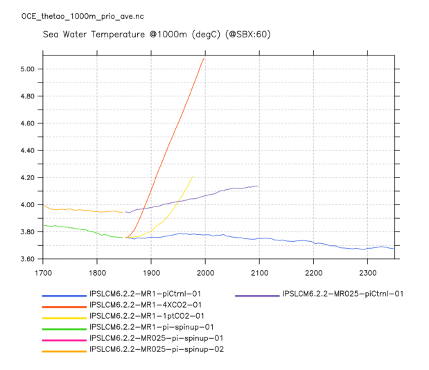
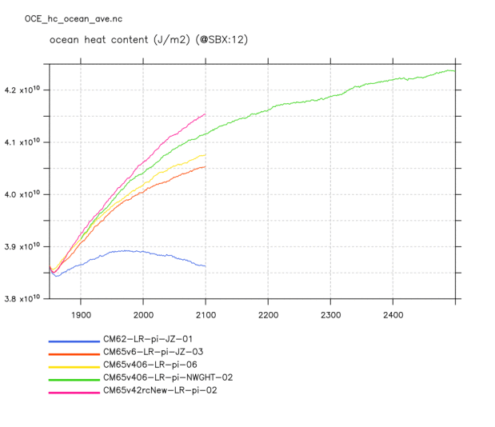
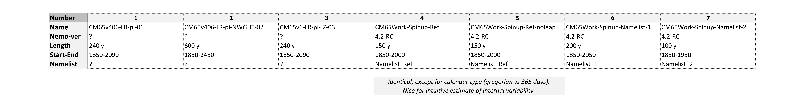
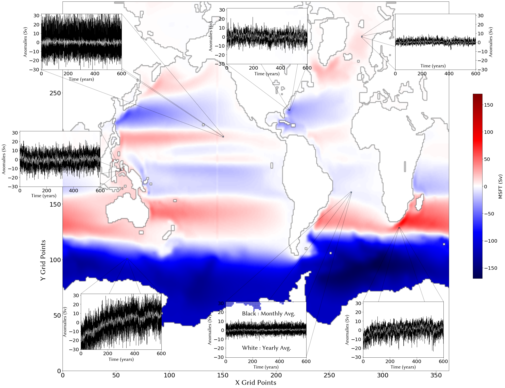

# Concept note on the use of IA to accelerate spinup of OGCM

## Motivation

* an illustration of spin-up time from the QUEST project

Illustration of spin-up of IPSLCM6.2.2-MR025 (orange) and bifurcation towards another equilibrium (purple) after ocean currents were (mistakingly) reset to 0 ; other lines illustrate the long-term drift of IPSLCM6.2.2-MR1 (green and blue) and the bifurcation due to (intentional) change in CO2 concentration (yellow and red). Variable is the temperature at 1000m depth, globally averaged.

* illustration of the database used in the present project

hrmes project focuses on simulations of IPSLCM6 produced with NEMO v4.0 and v4.2. Because this version of NEMO is still relatively new, there are several simulations (of the coupled model) that only differ in a few ocean parameters. Hence their time evolution in ocean heat content is very close from one simulation to the other, yet the values reached after 250 years are significantly different from one another. In the figure below, the blue line represents a simulation that included a bug in the representation of freshwater fluxes, hence was not considered in our database. The other four simulations were included in the database used for training and testing. 

## Dataset

In order to properly understand and accelerate the Spin-Up phase, we need to take into account the varying physics coming from the changing parameterization of our computational model(s) : the bigger and more varied our dataset, the better we should be able to extract a general behaviour, ensuring to some extent the viability of an acceleration method in all future simulations.
On the other hand — the Spin-Up process potentially spanning time-scales up the millenium — we need a dataset containing extensive lengths of simulation time, which goes against the need for a varied dataset since ressources are limited.

We tried to gather for a start 3 lengthy simulation runs, coming from previous versions of the NEMO model : this is what we defined as our Training Set (Sims 1-3). We then supplemented this first set with several shorter simulation runs using the current version of the NEMO model (v4.2.0–release candidate), as well as variations on the model parameters stemming from current development efforts : this is our Testing Set (Sims 4-7) on which acceleration attempts have been conducted.

**↓↓↓ Table summing up the Available Simulation Dataset : 3 Training Simulations (1-3) and 4 Testing Simulations (4-7).↓↓↓**

* The Barotropic Stream Function (MSFT) 

As a starting point of the Spin-Up Acceleration Process, we studied the Barotropic Stream Function (also called Mass Stream FuncTion, MSFT).

**↓↓↓ Time mean bartropic streamfunction (colours) and monthly anomalies in selected points (inserts) produced by Simulation #2↓↓↓**

As we can see with the time series of the selected points, it is not straightforward to extract a trend reflecting the global adjustment of the barotropic streamfunction, which lasts months to decades depending on the region. This calls for statistical analysis of the dataset, to extract the underlying spin-up phase. 

## First step : reducing complexity in dataset

* PCA
PCA sur 1 seule simu à la fois 
Figure qui montre series temporelles du 1er mode pour chaque simu + reconstruction du 1er mode à partir de PCA sur la plus longue

Figure qui montre carte du 1er mode sur serie la plus longue

Figure qui montre series temporelles PCA pour 2e mode pour chaque simu

Figure qui montre series temporelles pour 3e mode pour chaque simu

* DMD

????

## Second step : emulating spin up time series

Figure qui montre 1er mode avec gaussian guess...

## Third step : injecting accelerated MSFT into NEMO

Figure qui montre ?!?

